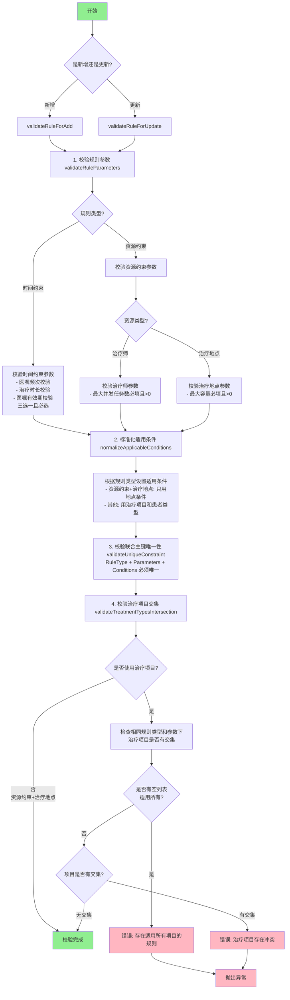

## 重构了 `checkRuleParameters` 校验方法

> **📊 流程图查看说明：**
> 本文档包含 Mermaid 格式的流程图，您可以通过以下方式查看：
> 1. **在线查看**：访问 [Mermaid Live Editor](https://mermaid.live/)，将下方代码粘贴到编辑器中
> 2. **GitHub**：在 GitHub 仓库中查看时，Mermaid 图表会自动渲染
> 3. **支持 Mermaid 的编辑器**：如 VS Code（安装插件）、Typora、Obsidian 等

### 🔄 校验流程总览

### 主要改进点：

#### 1. **方法结构更清晰**
- 将原本的单一方法拆分为多个专门的校验方法
- 每个方法都有明确的职责和详细的注释
- 代码可读性和可维护性大幅提升

#### 2. **完善的业务规则实现**

##### **时间约束规则**
- 严格校验三选一（医嘱频次、治疗时长、医嘱有效期）
- 必须选择且只能选择一个

##### **资源约束规则**
- 治疗师：必填最大并发任务数且大于0
- 治疗地点：必填最大容量且大于0

#### 3. **联合主键唯一性校验**
- 确保 `RuleType + ScheduleRuleParameters + applicableConditions` 三者组合唯一
- 更新时自动排除自身记录

#### 4. **治疗项目交集校验**
- 相同规则类型和参数下，治疗项目不能有交集
- 空列表代表适用所有，会阻止其他规则添加
- 提供详细的冲突项目信息

#### 5. **智能的适用条件处理**
- 根据规则类型自动设置正确的适用条件
- 资源约束+治疗地点：只使用地点条件
- 其他情况：使用治疗项目和患者类型条件
- 自动清理不相关的条件字段

### 新增的辅助方法：

1. **validateRuleForAdd/Update** - 入口方法，区分新增和更新
2. **validateRuleParameters** - 参数必填性和互斥性校验
3. **validateTimeConstraintParameters** - 时间约束参数校验
4. **validateResourceConstraintParameters** - 资源约束参数校验
5. **normalizeApplicableConditions** - 标准化适用条件
6. **validateUniqueConstraint** - 联合主键唯一性校验
7. **validateTreatmentTypesIntersection** - 治疗项目交集校验
8. **isUsingTreatmentTypes** - 判断是否使用治疗项目
9. **findSimilarRules** - 查找相似规则
10. **findIntersection** - 计算列表交集

### 错误提示优化：
- 所有错误信息都更加明确和友好
- 冲突时会显示具体的冲突项目
- 参数错误时会提示具体要求
